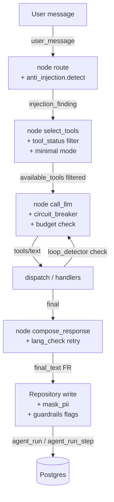

# F58 — Agent Guardrails (architecture)

Couches de protection ajoutées par F58 au-dessus de l'agent LangGraph
(F53–F57). Toutes les couches sont **opt-out par flag** ou **fail-safe**
(jamais bloquante en cas d'erreur infrastructure).

## Vue d'ensemble du flow

## Modules livrés

| Module | Rôle | FR couvert |
|---|---|---|
| `anti_injection` | Détecte `ignore previous`, `</system>`, `DAN`, `developer mode`, etc. | FR-001 / FR-002 |
| `pii_patterns` + `pii_detector` | Masque mobile money UEMOA, IBAN, carte Luhn | FR-003 / FR-004 |
| `lang_check` | Détecte langue, force retry FR si dérive | FR-005 / FR-006 |
| `tool_status` | Kill-switch admin par tool, cache 30 s | FR-007 / FR-008 / FR-009 |
| `circuit_breaker` | In-memory per-worker, 3 erreurs/60 s → ouvre 5 min | FR-010 / FR-011 |
| `budget` | Cap 8 K/tour + sous-quotas conv/ocr | FR-012 / FR-013 / FR-014 / FR-015 |
| `loop_detector` | 3x mêmes args → loop_detected ; > 10 calls → force compose | FR-016 |

## Migrations

`0037_f58_guardrails.py` :
- nouvelle table `agent_tool_status` (PK `tool_name`),
- `account` + `daily_token_quota`/`daily_conversation_quota`/`daily_ocr_analysis_quota` (CHECK sum),
- `agent_run` + 6 flags (`injection_detected`, `pii_masked_count`, `language_corrected`, `loop_detected`, `circuit_breaker_open`, `mode`),
- `agent_run_step` + `flow` (CHECK 'conversation'|'ocr_analysis'),
- 3 index pour dashboard admin metrics.

## Endpoints admin

| Endpoint | Description |
|---|---|
| `POST /admin/agent/tools/{name}/disable` | Kill-switch (audit log) |
| `POST /admin/agent/tools/{name}/enable` | Réactivation (audit log) |
| `GET /admin/agent/tools` | Liste consolidée (registry + DB) |
| `GET /admin/agent/metrics/sourcing?period=7d` | F56 sourcing |
| `POST /admin/agent/tools/{name}/...` | Non-admin reçoit 401/403 |

## Eval continue

| Script | Mode | Threshold | CI |
|---|---|---|---|
| `scripts/eval_agent.py` | mock | 0.95 | Chaque PR (smoke) |
| `scripts/eval_agent.py` | real | 0.75 | Nightly + label `eval-required` |
| `scripts/eval_jailbreak.py` | mock | 0 fuite | Chaque PR (smoke) |

## Latence

NFR-001 : guardrails (anti_injection + mask_pii + detect_language) < 30 ms
p95 par tour. Mesuré via `tests/perf/test_guardrails_latency.py` (post-MVP).

## Mode dégradé

`LLM_AGENT_MODE=minimal` :
- LangGraph reste compilé,
- `select_tools` ne propose plus que `cite_source` + `flag_unsourced`,
- mutations / recall_memory / search_source désactivés,
- `agent_run.mode = 'minimal'` enregistré.

Bascule en cours de run : drain (les runs déjà démarrés terminent dans
leur mode initial — clarification Q1).

## Hors-scope MVP

- Détection ML d'injection (rules + heuristique en MVP).
- PII multilingue (Wolof / Bambara) — MVP couvre FR + UEMOA.
- Coordination multi-worker du circuit breaker (Redis) — single uvicorn worker
  en MVP, clarification Q2.
- Backfill PII rétroactif — forward-only (clarification Q4).
