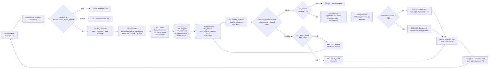

```mermaid
flowchart LR
    U[Utilisateur PME<br/>message FR] --> API[POST /chat/messages<br/>chat/api.py]
    API --> THR{Thread actif ?<br/>service.ensure_active_thread}
    THR -->|non| NEW[create_thread + audit]
    THR -->|archivé| ERR409[409 ThreadArchivedError]
    THR -->|ok| PUSER[persist_user_turn<br/>insert message + audit MANUAL]

    PUSER --> CLS[Intent Classifier<br/>orchestrator/intent_classifier.py<br/>règles FR + cache TTL 600s]
    CLS --> SEL[Tool Selector<br/>tool_selector.py<br/>≤ 10 tools / intent<br/>+ skill_whitelist]
    SEL --> REG[(Tool Registry<br/>tool_registry.py<br/>schémas Pydantic v2<br/>extra='forbid')]

    REG --> LLM[LLM OpenRouter<br/>llm_client.py<br/>LLM_MODEL minimax-m2.7<br/>tools filtrés]
    LLM --> STREAM[SSE stream_assistant<br/>chat/llm_stream.py<br/>text_delta...]
    STREAM --> VAL{payload_validator.validate<br/>schéma strict + closed enums}

    VAL -->|valide| SRC{cite_source<br/>préalable ? P1}
    SRC -->|non| ERR_SRC[Reject — pas de source]
    SRC -->|oui| EXEC[Exécution skill<br/>app/skills/ ≤ 1-2/turn<br/>activation_rules + anti_injection]

    VAL -->|invalide| RET{retry_policy.decide<br/>retry_count}
    RET -->|< 2| BRP[build_retry_prompt<br/>réinjection erreurs] --> LLM
    RET -->|≥ 2| FB[FALLBACK_TEXT<br/>reformuler]

    EXEC --> POST[Post-processor<br/>llm/post_processor.py<br/>patterns]
    POST --> UI{Interaction requise ?<br/>P10}
    UI -->|oui| BS[Bottom Sheet GSAP<br/>radios/QCU/upload/yes-no]
    UI -->|non| BUB[Bulle LLM display-only<br/>texte/KPI/charts/mermaid]

    BS --> PASS[persist_assistant_turn<br/>audit source=LLM]
    BUB --> PASS
    FB --> PASS
    PASS --> EVT[event_bus + EventBus/SSE<br/>sync bidirectionnelle P8]
    EVT --> U
```
