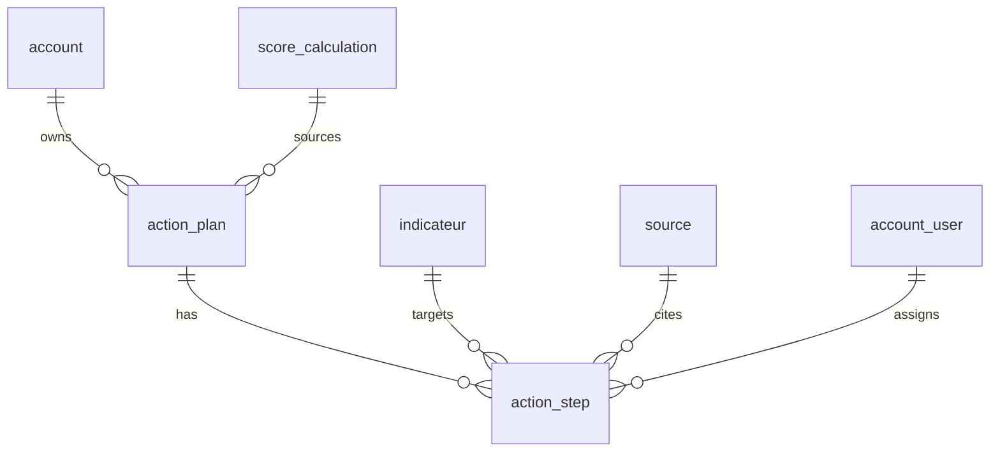

# Phase 1 Data Model — F31 Plan d'Action MVP

**Feature**: 031-plan-action-rappels-bibliotheque
**Date**: 2026-04-29

## Vue d'ensemble

Deux nouvelles tables : `action_plan` (entête, versionnée par PME) et `action_step` (lignes ordonnées). RLS strict via `account_id` (direct sur `action_plan`, indirect sur `action_step` via FK).

## Enums Postgres

```sql
CREATE TYPE action_step_category   AS ENUM ('esg','carbone','credit','candidature');
CREATE TYPE action_step_priority   AS ENUM ('haute','moyenne','basse');
CREATE TYPE action_step_status     AS ENUM ('todo','doing','done','postponed');
```

Horizon entier contraint en SQL (CHECK), pas un enum (3 valeurs seulement).

## Table `action_plan`

| Colonne                | Type             | Contraintes                                              |
|------------------------|------------------|----------------------------------------------------------|
| id                     | UUID             | PK, default `gen_random_uuid()`                          |
| account_id             | UUID             | NOT NULL, FK `account(id)` ON DELETE CASCADE             |
| horizon_months         | INTEGER          | NOT NULL, CHECK (horizon_months IN (6,12,24))            |
| version                | INTEGER          | NOT NULL, CHECK (version >= 1)                           |
| score_calculation_id   | UUID             | NULL, FK `score_calculation(id)` ON DELETE SET NULL      |
| generated_at           | TIMESTAMPTZ      | NOT NULL, default `now()`                                |
| generated_by_user_id   | UUID             | NULL, FK `account_user(id)`                              |

Index :
- `UNIQUE (account_id, version)` — sérialise les régénérations.
- `INDEX (account_id, generated_at DESC)` — pour `GET /me/action-plan` (dernier plan).

RLS :
```sql
ALTER TABLE action_plan ENABLE ROW LEVEL SECURITY;
CREATE POLICY action_plan_isolation ON action_plan
  USING (account_id = current_setting('app.current_account_id', true)::uuid)
  WITH CHECK (account_id = current_setting('app.current_account_id', true)::uuid);
```

## Table `action_step`

| Colonne                | Type                       | Contraintes                                                      |
|------------------------|----------------------------|------------------------------------------------------------------|
| id                     | UUID                       | PK, default `gen_random_uuid()`                                  |
| plan_id                | UUID                       | NOT NULL, FK `action_plan(id)` ON DELETE CASCADE                 |
| title                  | TEXT                       | NOT NULL, CHECK (length(title) BETWEEN 3 AND 200)                |
| description            | TEXT                       | NULL                                                             |
| category               | action_step_category       | NOT NULL                                                         |
| priority               | action_step_priority       | NOT NULL                                                         |
| horizon_at             | DATE                       | NOT NULL                                                         |
| status                 | action_step_status         | NOT NULL, default `'todo'`                                       |
| responsible_user_id    | UUID                       | NULL, FK `account_user(id)` ON DELETE SET NULL                   |
| indicateur_id          | UUID                       | NULL, FK `indicateur(id)` ON DELETE SET NULL                     |
| source_id              | UUID                       | NULL, FK `source(id)` ON DELETE SET NULL                         |
| created_at             | TIMESTAMPTZ                | NOT NULL, default `now()`                                        |
| updated_at             | TIMESTAMPTZ                | NOT NULL, default `now()`                                        |

Index :
- `INDEX (plan_id)` — listing des étapes d'un plan.
- `INDEX (plan_id, priority, horizon_at)` — tri natif côté DB.

Trigger : `BEFORE UPDATE` met à jour `updated_at` (helper applicatif ou trigger PG dédié).

RLS :
```sql
ALTER TABLE action_step ENABLE ROW LEVEL SECURITY;
CREATE POLICY action_step_isolation ON action_step
  USING (
    plan_id IN (SELECT id FROM action_plan
                WHERE account_id = current_setting('app.current_account_id', true)::uuid)
  )
  WITH CHECK (
    plan_id IN (SELECT id FROM action_plan
                WHERE account_id = current_setting('app.current_account_id', true)::uuid)
  );
```

## Transitions d'état (`status`)

| From       | To autorisés                               |
|------------|--------------------------------------------|
| todo       | doing, done, postponed                     |
| doing      | done, postponed, todo                      |
| done       | doing (réouverture), postponed             |
| postponed  | todo, doing                                |

En MVP, **toute transition entre statuts définis est autorisée** (pas de machine d'état stricte). Seules les valeurs hors enum sont rejetées (422).

## Audit

Toutes les mutations passent par `app.audit.record_audit(...)` (F04) :
- generate → action `create`, table `action_plan` + N×`action_step`, `source_of_change='manual'`.
- patch step → action `update`, table `action_step`, before/after dict, `source_of_change='manual'`.

## Schéma logique (Mermaid)



## Données par défaut / seed

Aucun seed obligatoire en MVP. La génération produit dynamiquement le plan à partir d'un `ScoreCalculation` existant. Tests utilisent des fixtures Pydantic + SQLAlchemy synthétiques.

## Hors-scope MVP (DEFERRED)

- Table `notification` (FR-008 brouillon).
- Table `ressource` + sous-types (FR-009 brouillon).
- Colonnes `cost_money` / `benefit_money` sur `action_step` (Money typé reporté).
