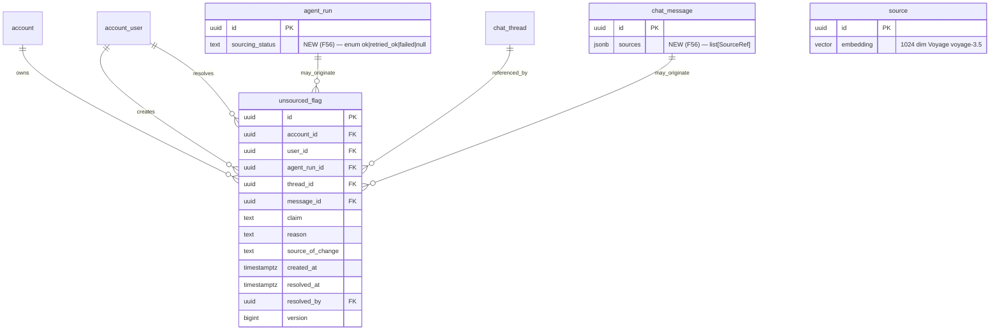

# Data Model — F56 Agent Sourcing Enforcement

**Date**: 2026-05-06
**Status**: Phase 1 complete
**Migration target**: `0035_f56_unsourced_flag_and_sourcing_columns`

## Overview

F56 introduces 1 new table (`unsourced_flag`), 2 ALTER (`agent_run`, `chat_message`), and 1 conditional CREATE INDEX (`source.embedding`). All changes follow constitutional invariants P2/P3/P9.

## ER (additions)



## 1. New table: `unsourced_flag`

### Columns

| Column            | Type                          | Constraints                                                  | Notes                                           |
|-------------------|-------------------------------|--------------------------------------------------------------|-------------------------------------------------|
| id                | UUID                          | PRIMARY KEY DEFAULT gen_random_uuid()                        |                                                 |
| account_id        | UUID                          | NOT NULL, REFERENCES account(id)                             | RLS scope (P2)                                  |
| user_id           | UUID                          | NOT NULL, REFERENCES account_user(id)                        | who triggered (LLM run or admin)                |
| agent_run_id      | UUID                          | NULL, REFERENCES agent_run(id) ON DELETE SET NULL            |                                                 |
| thread_id         | UUID                          | NULL, REFERENCES chat_thread(id) ON DELETE SET NULL          | needed for dedup                                |
| message_id        | UUID                          | NULL, REFERENCES chat_message(id) ON DELETE SET NULL         | optional                                        |
| claim             | TEXT                          | NOT NULL, CHECK (length(claim) BETWEEN 1 AND 1000)           |                                                 |
| reason            | TEXT                          | NOT NULL, CHECK (length(reason) BETWEEN 1 AND 500)           |                                                 |
| source_of_change  | source_of_change_t (enum)     | NOT NULL DEFAULT 'llm'                                       | 'llm' \| 'manual' \| 'admin' \| 'import'        |
| created_at        | TIMESTAMPTZ                   | NOT NULL DEFAULT now()                                       |                                                 |
| resolved_at       | TIMESTAMPTZ                   | NULL                                                         | NULL = open                                     |
| resolved_by       | UUID                          | NULL, REFERENCES account_user(id)                            | admin who resolved                              |
| version           | BIGINT                        | NOT NULL DEFAULT 1                                           | optimistic locking                              |

### Indexes

```sql
CREATE INDEX ix_unsourced_flag_account_created
  ON unsourced_flag (account_id, created_at DESC);

-- Dedup partial UNIQUE (Q1 clarification)
CREATE UNIQUE INDEX ix_unsourced_flag_unique_unresolved
  ON unsourced_flag (account_id, thread_id, lower(claim))
  WHERE resolved_at IS NULL;

-- For admin backlog filtering
CREATE INDEX ix_unsourced_flag_unresolved
  ON unsourced_flag (account_id, created_at DESC)
  WHERE resolved_at IS NULL;
```

### RLS (P2)

```sql
ALTER TABLE unsourced_flag ENABLE ROW LEVEL SECURITY;
ALTER TABLE unsourced_flag FORCE ROW LEVEL SECURITY;

CREATE POLICY unsourced_flag_account_isolation ON unsourced_flag
  USING (account_id = current_setting('app.current_account_id', true)::uuid)
  WITH CHECK (account_id = current_setting('app.current_account_id', true)::uuid);
```

### Audit append-only (P3)

```sql
-- Revoke UPDATE/DELETE on app role
REVOKE UPDATE, DELETE ON unsourced_flag FROM app_user;

-- INSERT allowed for app_user (handler flag_unsourced)
GRANT SELECT, INSERT ON unsourced_flag TO app_user;

-- Resolution: granted only to admin role
GRANT UPDATE (resolved_at, resolved_by, version) ON unsourced_flag TO app_admin;
```

The `audit_log` table records the INSERT via `tool_call_log` (F55) cross-link.

## 2. ALTER `agent_run`

```sql
-- New column: sourcing status of the run
ALTER TABLE agent_run
  ADD COLUMN IF NOT EXISTS sourcing_status TEXT NULL
    CHECK (sourcing_status IN ('ok','retried_ok','failed') OR sourcing_status IS NULL);
```

Lifecycle :
- NULL on creation.
- `'ok'` set when validator returns `decision='accept'` on first try.
- `'retried_ok'` set when validator returned `decision='retry'`, retry happened, and second pass returned `accept`.
- `'failed'` set when retry failed and fallback was emitted.

## 3. ALTER `chat_message`

```sql
-- New column: aggregated sources cited in this message
ALTER TABLE chat_message
  ADD COLUMN IF NOT EXISTS sources JSONB NULL;

-- GIN index for top-source metric queries (FR-013)
CREATE INDEX IF NOT EXISTS ix_chat_message_sources_gin
  ON chat_message USING GIN ((sources));
```

JSON schema (informal — see `contracts/sse-events.md` for canonical schema):

```json
[
  {
    "source_id": "<uuid>",
    "title": "...",
    "publisher": "...",
    "url": "...",
    "page": "..." | null,
    "section": "..." | null,
    "verification_status": "verified",
    "version": "..." | null,
    "citation_index": 1,
    "spans": [[42, 78], [120, 150]]
  }
]
```

Constraint validation is enforced application-side (Pydantic), not at DB level (JSONB).

## 4. Conditional CREATE INDEX `source.embedding`

If F03 didn't already create a vector index :

```sql
DO $$
BEGIN
  IF NOT EXISTS (
    SELECT 1 FROM pg_indexes
    WHERE indexname IN ('ix_source_embedding_cosine', 'source_embedding_idx')
  ) THEN
    -- Prefer HNSW when pgvector >= 0.5
    CREATE INDEX ix_source_embedding_cosine
      ON source USING hnsw (embedding vector_cosine_ops);
  END IF;
END $$;
```

Fallback for pgvector < 0.5 :

```sql
CREATE INDEX IF NOT EXISTS ix_source_embedding_cosine_ivfflat
  ON source USING ivfflat (embedding vector_cosine_ops) WITH (lists = 100);
```

The migration tries HNSW first ; if it fails (extension version), falls back to ivfflat.

## 5. In-memory entities (Pydantic / dataclass)

### `Claim`

```python
from dataclasses import dataclass
from typing import Literal

ClaimKind = Literal[
    "number_with_unit",
    "percentage",
    "ratio",
    "range",
    "reference_keyword",
    "threshold",
    "formula",
]

@dataclass(frozen=True)
class Claim:
    span: tuple[int, int]
    kind: ClaimKind
    raw: str
    from_tool: bool = False
```

### `SourcingValidationResult`

```python
from pydantic import BaseModel, ConfigDict

SourcingMode = Literal["strict", "permissive", "off"]
SourcingDecision = Literal["accept", "retry", "fallback", "annotate"]

class CitationRef(BaseModel):
    model_config = ConfigDict(extra="forbid")
    tool_call_id: str
    source_id: UUID
    paragraph_index: int  # 0-based

class SourcingValidationResult(BaseModel):
    model_config = ConfigDict(extra="forbid")
    claims_detected: list[Claim]
    citations_found: list[CitationRef]
    unsourced_claims: list[Claim]
    mode: SourcingMode
    decision: SourcingDecision
    duration_ms: int
```

### `SourceRef` (in `chat_message.sources` and SSE `payload.sources`)

```python
class SourceRef(BaseModel):
    model_config = ConfigDict(extra="forbid")
    source_id: UUID
    title: str
    publisher: str
    url: str
    page: str | None = None
    section: str | None = None
    verification_status: Literal["verified", "outdated"]
    version: str | None = None
    citation_index: int = Field(ge=1)
    spans: list[tuple[int, int]] = Field(default_factory=list)
```

## 6. State changes (F53 LangGraph)

```python
# app/agent/state.py — additions
class AgentState(BaseModel):
    # ... existing fields ...
    sourcing_retry_count: Annotated[int, _max_reducer] = 0
    sourcing_decision: SourcingDecision | None = None
    sourcing_validation_result: SourcingValidationResult | None = None
```

`_max_reducer` is a LangGraph reducer that takes the maximum value across patches (idempotent).

## 7. Audit chain

| Action                              | Audit log entry                                                  |
|-------------------------------------|------------------------------------------------------------------|
| `flag_unsourced` tool call          | `tool_call_log(tool_name='flag_unsourced', status='ok')` + `audit_log(entity_type='unsourced_flag', entity_id=<id>, source_of_change='llm')`  |
| `cite_source` tool call             | `tool_call_log(tool_name='cite_source', status='ok' | 'source_unverified')` (no audit_log row — read-only)  |
| `search_source` tool call           | `tool_call_log(tool_name='search_source', status='ok' | 'degraded')` (no audit_log row — read-only) |
| Admin resolves an `unsourced_flag` | `audit_log(entity_type='unsourced_flag', field='resolved_at', source_of_change='admin')` |

## 8. Permissions matrix (RLS + GRANT)

| Role        | unsourced_flag | agent_run.sourcing_status | chat_message.sources |
|-------------|----------------|---------------------------|----------------------|
| `app_user`  | SELECT, INSERT | UPDATE (own runs only via RLS) | UPDATE (own messages via RLS) |
| `app_admin` | SELECT, INSERT, UPDATE (resolved_*) | SELECT (cross-tenant for metrics) | SELECT (cross-tenant for metrics) |

Cross-tenant access via app_admin is filtered at the FastAPI layer (admin endpoint sets a special `app.current_account_id = '00000000-...'` sentinel and bypasses RLS in queries that aggregate).

## 9. Migration outline

`backend/alembic/versions/0035_f56_unsourced_flag_and_sourcing_columns.py`:

```python
"""F56 — unsourced_flag table + agent_run.sourcing_status + chat_message.sources + source embedding index.

Revision ID: 0035_f56_unsourced_flag_and_sourcing_columns
Revises: 0034_f55_audit_tool_call_extensions
Create Date: 2026-05-06
"""

revision = "0035_f56_unsourced_flag_and_sourcing_columns"
down_revision = "0034_f55_audit_tool_call_extensions"


def upgrade() -> None:
    # 1. unsourced_flag table + indexes + RLS + GRANT/REVOKE
    op.execute("""CREATE TABLE IF NOT EXISTS unsourced_flag (...)""")
    op.execute("""CREATE INDEX ix_unsourced_flag_account_created ...""")
    op.execute("""CREATE UNIQUE INDEX ix_unsourced_flag_unique_unresolved ...""")
    op.execute("""ALTER TABLE unsourced_flag ENABLE ROW LEVEL SECURITY""")
    op.execute("""CREATE POLICY unsourced_flag_account_isolation ...""")
    op.execute("""REVOKE UPDATE, DELETE ON unsourced_flag FROM app_user""")
    op.execute("""GRANT UPDATE (resolved_at, resolved_by, version) ON unsourced_flag TO app_admin""")

    # 2. agent_run.sourcing_status
    op.execute("""ALTER TABLE agent_run ADD COLUMN IF NOT EXISTS sourcing_status TEXT NULL CHECK ...""")

    # 3. chat_message.sources
    op.execute("""ALTER TABLE chat_message ADD COLUMN IF NOT EXISTS sources JSONB NULL""")
    op.execute("""CREATE INDEX IF NOT EXISTS ix_chat_message_sources_gin ON chat_message USING GIN ((sources))""")

    # 4. source.embedding index (HNSW with ivfflat fallback)
    try:
        op.execute("""CREATE INDEX IF NOT EXISTS ix_source_embedding_cosine ON source USING hnsw (embedding vector_cosine_ops)""")
    except Exception:
        op.execute("""CREATE INDEX IF NOT EXISTS ix_source_embedding_cosine_ivfflat ON source USING ivfflat (embedding vector_cosine_ops) WITH (lists = 100)""")


def downgrade() -> None:
    op.execute("""DROP INDEX IF EXISTS ix_source_embedding_cosine""")
    op.execute("""DROP INDEX IF EXISTS ix_source_embedding_cosine_ivfflat""")
    op.execute("""DROP INDEX IF EXISTS ix_chat_message_sources_gin""")
    op.execute("""ALTER TABLE chat_message DROP COLUMN IF EXISTS sources""")
    op.execute("""ALTER TABLE agent_run DROP COLUMN IF EXISTS sourcing_status""")
    op.execute("""DROP TABLE IF EXISTS unsourced_flag CASCADE""")
```

Migration is idempotent (uses `IF NOT EXISTS` / `IF EXISTS`) and reversible.

## 10. Validation summary

| Invariant | Mechanism |
|-----------|-----------|
| P1 Sourcing | Validator + cite_source verified-only check |
| P2 RLS | account_id NOT NULL + RLS policy on unsourced_flag |
| P3 Audit append-only | UPDATE/DELETE revoked on app_user ; INSERT-only |
| P9 Pydantic strict | Tool schemas with `extra='forbid'` ; bounded fields |

All gates pass.
