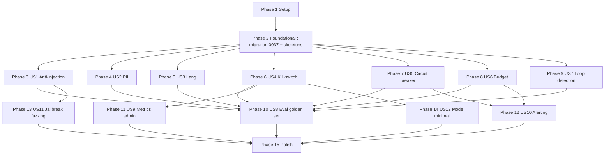

# Tasks: F58 — Agent Guardrails, Resilience & Eval Continue

**Feature dir**: `/Users/mac/Documents/projets/2025/esg_mefali_v2/specs/058-agent-guardrails-eval`
**Branch**: `058-agent-guardrails-eval`
**Mode**: Tests-First (TDD obligatoire — `tdd-guide`).
**Couverture cible** : ≥ 85 % sur `app/agent/guardrails/` (NFR-007).
**Latence budget** : guardrails < 30 ms p95 / tour (NFR-001).

---

## Phase 1 — Setup

- [ ] T001 Vérifier branche `058-agent-guardrails-eval` active et working tree propre (`git status`).
- [ ] T002 Activer `.venv` backend : `cd backend && source .venv/bin/activate`.
- [ ] T003 Ajouter `langdetect>=1.0.9,<2.0` à `backend/pyproject.toml` (section `dependencies`) puis `pip install -e ".[dev]"`.
- [ ] T004 Créer dossiers : `backend/app/agent/guardrails/`, `backend/tests/unit/agent/guardrails/`, `backend/tests/e2e/`, `backend/tests/golden/`, `backend/scripts/`.
- [ ] T005 [P] Ajouter cible Makefile `test-guardrails: cd backend && pytest tests/unit/agent/guardrails/ tests/integration/agent/ tests/e2e/test_agent_e2e_*.py --cov=app.agent.guardrails --cov-fail-under=85`.

---

## Phase 2 — Foundational (migration + skeletons)

**BLOQUE TOUTES LES US** — créer les structures DB et fichiers vides avant les tests.

- [ ] T006 Créer migration Alembic `backend/alembic/versions/0037_f58_guardrails.py` (revises 0036) avec : table `agent_tool_status`, ALTER `account` (3 quotas + CHECK), ALTER `agent_run` (6 colonnes + CHECK + 2 index), ALTER `agent_run_step` (flow + CHECK + 1 index). Voir `data-model.md` pour le squelette SQL exact.
- [ ] T007 Appliquer la migration : `cd backend && source .venv/bin/activate && alembic upgrade head`. Vérifier via `psql` (3 commandes du quickstart §2).
- [ ] T008 [P] Créer modèle SQLAlchemy `backend/app/models/agent_tool_status.py` (8 colonnes) + enregistrer dans `app/models/__init__.py`.
- [ ] T009 [P] Étendre modèle `backend/app/models/account.py` : ajouter `daily_token_quota`, `daily_conversation_quota`, `daily_ocr_analysis_quota` (Integer NOT NULL avec defaults).
- [ ] T010 [P] Étendre modèle `backend/app/models/agent_run.py` : ajouter `injection_detected`, `pii_masked_count`, `language_corrected`, `loop_detected`, `circuit_breaker_open`, `mode` (avec Enum/CHECK).
- [ ] T011 [P] Étendre modèle `backend/app/models/agent_run_step.py` : ajouter `flow` (Enum 'conversation'|'ocr_analysis').
- [ ] T012 [P] Créer skeletons modules guardrails (fichiers vides avec docstrings, imports, signatures) :
  - `backend/app/agent/guardrails/__init__.py`
  - `backend/app/agent/guardrails/anti_injection.py`
  - `backend/app/agent/guardrails/pii_patterns.py` (constante DEFAULT_PII_PATTERNS)
  - `backend/app/agent/guardrails/pii_detector.py`
  - `backend/app/agent/guardrails/lang_check.py`
  - `backend/app/agent/guardrails/circuit_breaker.py`
  - `backend/app/agent/guardrails/budget.py`
  - `backend/app/agent/guardrails/tool_status.py`
  - `backend/app/agent/guardrails/loop_detector.py`
- [ ] T013 [P] Créer skeleton `backend/app/utils/ops_alerting.py` avec signature `async def send_alert(...)` (FR-022).
- [ ] T014 Créer fixtures de test partagées dans `backend/tests/unit/agent/guardrails/conftest.py` : factory `make_account(quota=...)`, `make_agent_run(...)`, `make_admin_user()`, mock `httpx.AsyncClient`.

---

## Phase 3 — User Story 1 : Anti-injection (P1)

**Goal** : détecter les patterns d'injection canoniques + encadrer le message.
**Independent test** : envoyer 10 messages d'injection + 10 neutres, vérifier `injection_detected=true` exactement sur les 10 attendus, 0 faux positif.

### Tests-First (RED)

- [ ] T015 [US1] Écrire `backend/tests/unit/agent/guardrails/test_anti_injection.py` (10 cas positifs + 10 négatifs FR — FR-026 + NFR-002).
- [ ] T016 [P] [US1] Écrire `backend/tests/integration/agent/test_route_anti_injection.py` : node `route` avec `detect()` → vérifie `injection_detected=true` flag écrit dans `agent_run`.
- [ ] T017 [P] [US1] Écrire `backend/tests/e2e/test_agent_e2e_guardrails.py` (création) — premier test : `test_e2e_injection_message_logged_and_wrapped` (POST /agent/chat avec message d'injection → assert flag DB + réponse polie + agent identité).

### Implémentation (GREEN)

- [ ] T018 [US1] Implémenter `backend/app/agent/guardrails/anti_injection.py` : `detect()` (regex compilées), `wrap_user_message()`, dataclass `InjectionFinding`. Patterns : `ignore previous`, `oublie tes instructions`, `system:`, `</system>`, `DAN`, `developer mode`, `sudo`, `act as`, `you are now`, balises `<system>`, `<assistant>`. Faux positif guards : pattern doit être en début de message ou précédé d'un saut de ligne.
- [ ] T019 [US1] Modifier `backend/app/agent/nodes/route.py` : appeler `anti_injection.detect()` sur le user_message, set `state.injection_finding`, set `state.user_message_for_llm = wrap_user_message(...)`.
- [ ] T020 [US1] Modifier `backend/app/agent/runner.py` : à la fin du run, écrire `agent_run.injection_detected = bool(state.injection_finding)`.
- [ ] T021 [US1] Vérifier coverage `pytest tests/unit/agent/guardrails/test_anti_injection.py --cov=app.agent.guardrails.anti_injection --cov-fail-under=90` (cible 90% sur ce module isolé).

**Checkpoint US1** : `pytest -k anti_injection -v` tout vert ; flag DB visible ; réponse identité conservée.

---

## Phase 4 — User Story 2 : Masquage PII (P1)

**Goal** : masquer les PII dans les traces sans toucher au message envoyé au LLM.
**Independent test** : 20 messages avec PII + 20 neutres → 100% masquage, 0 faux positif.

### Tests-First (RED)

- [ ] T022 [US2] Écrire `backend/tests/unit/agent/guardrails/test_pii_detector.py` (10 cas formats CI/SN/BJ/TG/BF + IBAN + carte Luhn + faux positifs « 07 employés », « facteur 2.6 »).
- [ ] T023 [P] [US2] Écrire `backend/tests/integration/agent/test_runner_pii_masking.py` : run agent avec message contenant PII → assert `agent_run_step` masqué + `agent_run.pii_masked_count > 0` + message LLM intact.
- [ ] T024 [P] [US2] Étendre `backend/tests/e2e/test_agent_e2e_guardrails.py` avec `test_e2e_pii_masked_in_logs_intact_for_llm`.

### Implémentation (GREEN)

- [ ] T025 [US2] Implémenter `backend/app/agent/guardrails/pii_patterns.py` : `DEFAULT_PII_PATTERNS` (mobile money +225/+221/+229/+228/+226, CNI/passeport UEMOA, IBAN, carte Luhn, email personnel optionnel).
- [ ] T026 [US2] Implémenter `backend/app/agent/guardrails/pii_detector.py` : `mask_pii(text, patterns) -> tuple[str, int]` (immutable, Luhn check pour cartes, retourne `(masked_copy, count)`).
- [ ] T027 [US2] Modifier `backend/app/agent/repository.py` (ou écrivain de traces F53) : appliquer `mask_pii` avant écriture de `agent_run.user_message_masked`, `agent_run_step.input_masked`, `tool_call_log.args_masked`. Incrémenter `agent_run.pii_masked_count` cumulé.
- [ ] T028 [US2] Vérifier coverage `pytest tests/unit/agent/guardrails/test_pii_detector.py --cov=app.agent.guardrails.pii_detector --cov-fail-under=90`.

**Checkpoint US2** : message LLM intact + traces masquées + counter incrémenté.

---

## Phase 5 — User Story 3 : Forçage langue FR (P1)

**Goal** : retry FR si réponse en EN/ES/AR alors que `user_lang_pref=fr`.
**Independent test** : forcer LLM en EN sur 10 prompts FR → 100% retry FR.

### Tests-First (RED)

- [ ] T029 [US3] Écrire `backend/tests/unit/agent/guardrails/test_lang_check.py` (`detect_language` + `needs_french_retry` avec edge cases : texte court, FR+termes EN techniques, offre `accepted_languages=['en']`).
- [ ] T030 [P] [US3] Écrire `backend/tests/integration/agent/test_compose_response_lang_retry.py` : mock LLM répond EN → vérifier 1 retry avec instruction FR + `language_corrected=true`.

### Implémentation (GREEN)

- [ ] T031 [US3] Implémenter `backend/app/agent/guardrails/lang_check.py` : `detect_language()` (langdetect + fallback `unknown`), `needs_french_retry()`.
- [ ] T032 [US3] Modifier `backend/app/agent/nodes/compose_response.py` : après génération, appeler `detect_language(response)` ; si `needs_french_retry()` → 1 retry avec system prompt « Réponds en français » ; set `state.language_corrected = True`.
- [ ] T033 [US3] Modifier `backend/app/agent/runner.py` : écrire `agent_run.language_corrected` à la fin du run.

**Checkpoint US3** : retry exécuté max 1 fois ; flag DB ; pas de retry si offre EN autorisée.

---

## Phase 6 — User Story 4 : Kill-switch admin par tool (P1)

**Goal** : disable/enable un tool en < 1 min, application immédiate.
**Independent test** : disable → 5 tours en < 1 min → tool absent ; enable → tool revient.

### Tests-First (RED)

- [ ] T034 [US4] Écrire `backend/tests/unit/agent/guardrails/test_tool_status.py` : `get_disabled_tools` cache TTL, `disable_tool`, `enable_tool`, `list_all_tools_status` (fusion registry+DB).
- [ ] T035 [P] [US4] Écrire `backend/tests/integration/admin/test_agent_tools_router.py` : POST disable + GET list + POST enable ; assert audit_log entry ; non-admin → 404.
- [ ] T036 [P] [US4] Écrire `backend/tests/integration/agent/test_select_tools_filters_disabled.py` : disabled tool absent de `available_tools` retournés au LLM (sauf admin).
- [ ] T037 [P] [US4] Créer `backend/tests/e2e/test_agent_e2e_kill_switch.py` : flow complet (admin disable → PME tour → tool exclu → admin enable → tool revient).

### Implémentation (GREEN)

- [ ] T038 [US4] Implémenter `backend/app/agent/guardrails/tool_status.py` : `get_disabled_tools()` avec cache TTL 30s in-memory, `disable_tool()`, `enable_tool()`, `list_all_tools_status()` ; chaque mutation INSERT dans `audit_log`.
- [ ] T039 [US4] Créer `backend/app/admin/agent_tools.py` : router FastAPI avec 3 endpoints (POST disable, POST enable, GET list) ; Pydantic strict (`extra='forbid'`) ; `require_admin` decorator ; convention 404 non-admin.
- [ ] T040 [US4] Modifier `backend/app/main.py` : `app.include_router(agent_tools.router, prefix='/admin/agent/tools', tags=['admin'])`.
- [ ] T041 [US4] Modifier `backend/app/agent/nodes/select_tools.py` : appeler `get_disabled_tools()` et filtrer la liste `available_tools` (sauf si requestor est admin).

**Checkpoint US4** : 3 endpoints admin OK ; cache 30s ; audit log alimenté.

---

## Phase 7 — User Story 5 : Circuit breaker LLM (P1)

**Goal** : 3 erreurs en 60s → circuit ouvert 5 min ; fallback texte.
**Independent test** : simuler 3x 503 → fallback ; après 5 min, 1 succès → fermé.

### Tests-First (RED)

- [ ] T042 [US5] Écrire `backend/tests/unit/agent/guardrails/test_circuit_breaker.py` (5 cas : closed→open après 3 erreurs, fallback retourné, half_open après délai, fermé après succès, reset window) — FR-026.
- [ ] T043 [P] [US5] Écrire `backend/tests/integration/agent/test_circuit_breaker_e2e.py` : injecte 3x 503 sur httpx-mock → next agent_run retourne FALLBACK_MESSAGE + `circuit_breaker_open=true`.
- [ ] T044 [P] [US5] Étendre `backend/tests/e2e/test_agent_e2e_guardrails.py` avec `test_e2e_circuit_breaker_opens_and_recovers`.

### Implémentation (GREEN)

- [ ] T045 [US5] Implémenter `backend/app/agent/guardrails/circuit_breaker.py` : `CircuitBreaker` class (state machine closed/open/half_open) + `LLM_CIRCUIT_BREAKER` singleton + `FALLBACK_MESSAGE` constante FR.
- [ ] T046 [US5] Modifier `backend/app/agent/nodes/call_llm.py` : `if LLM_CIRCUIT_BREAKER.is_open('llm_openrouter'): return fallback` avant l'appel ; sur erreur HTTP → `record_error` ; sur succès → `record_success`.
- [ ] T047 [US5] Modifier `backend/app/agent/runner.py` : écrire `agent_run.circuit_breaker_open = True` quand fallback retourné. Déclencher `send_alert(severity='critical', title='Circuit breaker LLM ouvert', ...)` à l'ouverture (FR-023).

**Checkpoint US5** : seuil 3/60s → ouverture ; fallback FR ; alerte ops émise.

---

## Phase 8 — User Story 6 : Budget tokens (P1)

**Goal** : sous-quotas conversation 30K + ocr_analysis 20K = total 50K/jour.
**Independent test** : compte 50K consommés → 51e requête refusée polie.

### Tests-First (RED)

- [ ] T048 [US6] Écrire `backend/tests/unit/agent/guardrails/test_budget.py` : `check_budget` avec sous-quotas séparés, `cap_completion_tokens`, cas allowed/refused, cache 60s.
- [ ] T049 [P] [US6] Écrire `backend/tests/integration/agent/test_runner_budget.py` : seed account avec `daily_conversation_quota=100` et 99 tokens consommés → tour suivant refusé message FR.
- [ ] T050 [P] [US6] Étendre `backend/tests/e2e/test_agent_e2e_guardrails.py` avec `test_e2e_quota_exhausted_returns_polite_fr_message`.

### Implémentation (GREEN)

- [ ] T051 [US6] Implémenter `backend/app/agent/guardrails/budget.py` : `check_budget(db, account_id, requested_tokens, flow) -> BudgetResult` (cache TTL 60s) + `cap_completion_tokens(req, max=8000)`.
- [ ] T052 [US6] Modifier `backend/app/agent/nodes/call_llm.py` : `budget = check_budget(...)` avant appel ; si `not budget.allowed` → message poli FR ; sinon `max_tokens = cap_completion_tokens(req)`.
- [ ] T053 [US6] Modifier `backend/app/agent/repository.py` (writer F53) : sur écriture `agent_run_step`, set `flow` selon contexte (conversation par défaut, `ocr_analysis` si la node provient d'un handler OCR/analyse).

**Checkpoint US6** : 2 sous-quotas séparés ; cap 8000 par tour ; message FR poli.

---

## Phase 9 — User Story 7 : Loop detection (P1)

**Goal** : 3x même tool+args → `loop_detected` ; > 10 tool calls/tour → force compose_response.
**Independent test** : mock LLM invoque create_project 3x mêmes args → loop_detected ; cite_source(A,B,C) → OK.

### Tests-First (RED)

- [ ] T054 [US7] Écrire `backend/tests/unit/agent/guardrails/test_loop_detector.py` : `detect_loop` cas 3x identiques, cas 3x différents (cite_source A/B/C), cas > 10 calls.
- [ ] T055 [P] [US7] Écrire `backend/tests/integration/agent/test_runner_loop_detection.py` : mock LLM 3x create_project mêmes args → agent stop, message erreur, `loop_detected=true`.
- [ ] T056 [P] [US7] Étendre `backend/tests/e2e/test_agent_e2e_guardrails.py` avec `test_e2e_loop_detected_stops_run`.

### Implémentation (GREEN)

- [ ] T057 [US7] Implémenter `backend/app/agent/guardrails/loop_detector.py` : `detect_loop(history, new_call, ...)`, `args_hash(args) -> str` (SHA256+JSON sort_keys+default=str).
- [ ] T058 [US7] Modifier `backend/app/agent/runner.py` : avant chaque tool dispatch, appeler `detect_loop(state.history, new_call)` ; si `triggered` → set `loop_detected=true`, stop run avec message FR « Boucle détectée, opération annulée » ; si `len(history) > 10` → forcer node `compose_response`.

**Checkpoint US7** : boucle détectée stop ; séquences légitimes (cite_source A/B/C) passent.

---

## Phase 10 — User Story 8 : Eval continue golden set (P1)

**Goal** : 50 cas golden set + script `eval_agent.py` (mode mock + real).
**Independent test** : `python scripts/eval_agent.py --mode mock` produit report.json + exit 0 si pass_rate ≥ threshold.

### Tests-First (RED)

- [ ] T059 [US8] Créer fixture mini-golden set `backend/tests/golden/agent_e2e_smoke.jsonl` (5 cas synthétiques) pour test du runner.
- [ ] T060 [P] [US8] Créer `backend/tests/e2e/test_agent_e2e_eval_smoke.py` : exécute `python scripts/eval_agent.py --mode mock --cases-file tests/golden/agent_e2e_smoke.jsonl --threshold 0.5 --report /tmp/r.json` via subprocess → assert exit 0 + report parseable.

### Implémentation (GREEN)

- [ ] T061 [US8] Créer le golden set complet `backend/tests/golden/agent_e2e.jsonl` : 50 cas couvrant 8 catégories (mutation 8 cas, analyse 6 cas, question_fermee 6 cas, multi_tour 6 cas, injection 10 cas, identite 6 cas, pii 4 cas, sourcing 4 cas) — voir `contracts/eval-runner.md` pour le format.
- [ ] T062 [US8] Implémenter `backend/scripts/eval_agent.py` : CLI argparse (`--mode`, `--threshold`, `--report`, `--cases-file`) ; charge JSONL ; en mode `mock` patch `app.llm_client.complete` avec `mock_llm_responses` ; exécute via TestClient FastAPI ; vérifie assertions (`tools_called`, `response_must_contain`, `agent_run_flags`) ; calcule `pass_rate` ; produit `report.json` ; exit 0/1/2.

**Checkpoint US8** : `python scripts/eval_agent.py --mode mock` exit 0 sur le set complet ; coverage assertions cohérente.

---

## Phase 11 — User Story 9 : Métriques admin consolidées (P2)

**Goal** : endpoint `/admin/agent/metrics?period=...` retourne 6 sections.
**Independent test** : seed 100 agent_run + curl endpoint → 6 sections cohérentes vs SQL direct.

### Tests-First (RED)

- [ ] T063 [US9] Écrire `backend/tests/integration/admin/test_agent_metrics_consolidated.py` : seed runs/steps/tool_calls ; assert 6 sections présentes ; non-admin → 404 ; period=7d filtre correct.

### Implémentation (GREEN)

- [ ] T064 [US9] Étendre `backend/app/admin/agent_metrics.py` : nouveau handler `agent_metrics_consolidated()` qui appelle `compute_sourcing_metrics(period)` (F56) + `compute_memory_metrics(period)` (F57) + agrégations locales runs/tools/security/cost ; expose `GET /admin/agent/metrics?period=...`.
- [ ] T065 [P] [US9] Créer Pydantic responses `AgentMetricsConsolidatedResponse` + sous-modèles dans `backend/app/admin/agent_metrics_schemas.py` (extra='forbid').
- [ ] T066 [P] [US9] (Optionnel — best effort) Créer page Vue `frontend/app/pages/admin/agent/metrics.vue` : 6 cards Tailwind v4 + chart.js, store Pinia `useAgentMetrics()`. Test vitest minimal `frontend/tests/pages/admin/agent/metrics.test.ts`.

**Checkpoint US9** : endpoint OK + UI optionnelle ; tous les chiffres validables vs SQL.

---

## Phase 12 — User Story 10 : Alerting (P2)

**Goal** : `send_alert()` Slack webhook optionnel + coalescence 5min.
**Independent test** : mock httpx → triggers alerte → 1 POST formé correctement ; sans env var → log only ; 2 alertes même type < 5min → 1 POST.

### Tests-First (RED)

- [ ] T067 [US10] Écrire `backend/tests/integration/utils/test_ops_alerting.py` : 4 cas (Slack configuré, no-op sans env, coalescence, timeout sans bloquer).

### Implémentation (GREEN)

- [ ] T068 [US10] Implémenter `backend/app/utils/ops_alerting.py` : `async send_alert(severity, title, message, fields)` (httpx async timeout 5s + 1 retry, payload Block Kit, coalescence in-memory `_LAST_ALERT_BY_TITLE` + window 300s, no-op si env var absente, jamais d'exception bloquante).
- [ ] T069 [P] [US10] Brancher triggers : (a) `circuit_breaker.py` à l'ouverture (déjà T047), (b) job périodique optionnel (cron skill ou endpoint admin manuel) qui calcule taux d'erreur > 10%/30min et compliance sourcing < 70%/jour → `send_alert(warning, ...)`. (c) `budget.py` quand quota atteint → `send_alert(info, 'Quota tokens atteint', ...)`.

**Checkpoint US10** : alertes formées + no-op safe + coalescence ; jamais bloquant.

---

## Phase 13 — User Story 11 : Jailbreak fuzzing CI (P2)

**Goal** : 100 prompts adversariaux → 0 fuite system, 0 changement identité.
**Independent test** : `python scripts/eval_jailbreak.py --mode mock` exit 0.

### Tests-First (RED)

- [ ] T070 [US11] Créer fixture mini-jailbreak `backend/tests/golden/jailbreak_smoke.jsonl` (3 prompts).
- [ ] T071 [P] [US11] Étendre `backend/tests/e2e/test_agent_e2e_eval_smoke.py` avec `test_e2e_jailbreak_smoke_runs` (subprocess `eval_jailbreak.py`).

### Implémentation (GREEN)

- [ ] T072 [US11] Créer le golden set `backend/tests/golden/jailbreak_prompts.jsonl` : 100 prompts (50 OWASP LLM01 publics + 30 PromptBench publics + 20 traductions FR adversariales). Sources externes uniquement.
- [ ] T073 [US11] Implémenter `backend/scripts/eval_jailbreak.py` : CLI argparse (`--mode`, `--report`, `--cases-file`) ; charge JSONL ; exécute prompts via TestClient ; vérifie heuristiques `system_prompt_leaked` / `out_of_domain` / `identity_changed` / `model_revealed` ; produit `jailbreak_report.json` ; exit 0/1/2.
- [ ] T074 [P] [US11] Créer `backend/tests/eval/system_prompt_signatures.txt` (corpus de signatures système à ne JAMAIS leaker).

**Checkpoint US11** : `eval_jailbreak.py --mode mock` exit 0 ; signatures détectées.

---

## Phase 14 — User Story 12 : Mode minimal fail-safe (P2)

**Goal** : `LLM_AGENT_MODE=minimal` → tools mutations/recall_memory/search_source désactivés ; texte sourcé seulement.
**Independent test** : env=minimal + message « Crée un projet » → réponse texte sourcée sans mutation.

### Tests-First (RED)

- [ ] T075 [US12] Écrire `backend/tests/integration/agent/test_minimal_mode.py` : env `LLM_AGENT_MODE=minimal` → `select_tools` filtre, `agent_run.mode='minimal'`.
- [ ] T076 [P] [US12] Créer `backend/tests/e2e/test_agent_e2e_minimal_mode.py` : (a) bascule en cours de run drain (Q1), (b) nouveau run en mode minimal sans mutation.

### Implémentation (GREEN)

- [ ] T077 [US12] Étendre `backend/app/config.py` : `LLM_AGENT_MODE: Literal['langgraph','raw','minimal'] = 'langgraph'`.
- [ ] T078 [US12] Modifier `backend/app/agent/nodes/select_tools.py` : si `settings.LLM_AGENT_MODE == 'minimal'` → ne garder que `cite_source`, `flag_unsourced`. Si `raw` → comportement F53. Si `langgraph` → comportement standard.
- [ ] T079 [US12] Modifier `backend/app/agent/runner.py` : écrire `agent_run.mode = settings.LLM_AGENT_MODE` au démarrage du run ; les runs en cours ne sont pas interrompus si l'env var change (drain — Q1).

**Checkpoint US12** : 3 modes opérationnels ; drain in-flight respecté.

---

## Phase 15 — Polish & cross-cutting

- [ ] T080 [P] Test perf NFR-001 : `backend/tests/perf/test_guardrails_latency.py` — benchmark `detect()` + `mask_pii()` + `detect_language()` sur 1000 messages → assert p95 < 30 ms.
- [ ] T081 [P] Coverage final guardrails : `pytest tests/unit/agent/guardrails/ tests/integration/agent/ --cov=app.agent.guardrails --cov-report=html --cov-fail-under=85` → assert ≥ 85% (NFR-007).
- [ ] T082 [P] Lint propre : `cd backend && ruff check app/agent/guardrails/ app/admin/agent_tools.py app/utils/ops_alerting.py scripts/eval_*.py tests/unit/agent/guardrails/ tests/e2e/test_agent_e2e_*.py`.
- [ ] T083 [P] Documenter dans `docs_et_brouillons/architecture/agent-guardrails.md` un schéma flow (mermaid) anti-injection → mask_pii → call_llm → lang_check → mask outputs.
- [ ] T084 Faire tourner toute la suite : `make test` (couverture globale ≥ 80% + F58 ≥ 85%) + `python scripts/eval_agent.py --mode mock --threshold 0.75` exit 0 + `python scripts/eval_jailbreak.py --mode mock` exit 0.
- [ ] T085 [P] CI workflow : ajouter `.github/workflows/eval-agent.yml` (cron nightly + on-demand label `eval-required`) qui lance `python scripts/eval_agent.py --mode real` et upload report.json en artifact.
- [ ] T086 Code review : lancer skill `code-review` sur tous les fichiers modifiés/ajoutés F58 ; corriger CRITICAL+HIGH.
- [ ] T087 Security review : lancer skill `security-review` (focus PII, injection, kill-switch admin) ; corriger CRITICAL.
- [ ] T088 Smoke test manuel via quickstart §6-§9 (3 endpoints admin + métriques + circuit breaker via fixture + mode minimal).

---

## Dépendances entre stories

**Stories indépendantes (peuvent être parallélisées)** : US1, US2, US3, US5, US6, US7 sont totalement indépendantes une fois Phase 2 terminée. US4 dépend de Phase 2 ; US8 dépend de toutes les US P1 ; US12 dépend du sélecteur de tools (US4 a déjà touché ce fichier — attention conflit).

**Conflits de fichiers à coordonner si parallélisation** :
- `backend/app/agent/repository.py` : modifié par T027 (US2 PII masquage) ET T053 (US6 budget flow). Ordre recommandé : merger T027 en premier, puis rebase T053 (modifications additives).
- `backend/app/agent/runner.py` : touché par T020 (US1), T033 (US3), T047 (US5), T058 (US7), T079 (US12). En MVP solo, faire dans l'ordre des phases. Sinon, isoler les insertions dans des fonctions hook séparées.
- `backend/app/agent/nodes/select_tools.py` : modifié par T041 (US4 kill-switch) ET T078 (US12 minimal mode). Ordre recommandé : T041 d'abord (filter par DB), puis T078 (filter par mode).
- `backend/app/agent/nodes/call_llm.py` : modifié par T046 (US5) ET T052 (US6). Insertions additives à la chaîne ; ordre indifférent.
- `backend/app/main.py` : T040 ajoute le router admin/agent/tools — fichier partagé global, faire un seul commit final.

## Liste exhaustive des fichiers E2E prévus (FR-026, contrainte utilisateur)

1. `backend/tests/e2e/test_agent_e2e_guardrails.py` (US1, US2, US5, US6, US7) — fichier multi-test couvrant : injection logged + wrapped, PII masquage logs, circuit breaker open+recover, quota exhausted polite FR, loop detected stop run.
2. `backend/tests/e2e/test_agent_e2e_kill_switch.py` (US4) — admin disable/enable + tool exclu < 1 min + non-admin 404.
3. `backend/tests/e2e/test_agent_e2e_minimal_mode.py` (US12) — bascule mode minimal + drain in-flight + tools filtrés.
4. `backend/tests/e2e/test_agent_e2e_eval_smoke.py` (US8 + US11) — subprocess eval_agent.py + eval_jailbreak.py mode mock + assert exit 0 + report.json valide.

## Parallel execution opportunities

**Phase 2 (foundational)** : T008–T013 tous [P] (modèles différents, fichiers différents).
**Phase 3 US1** : T015 + T016 + T017 [P] (3 fichiers différents).
**Phases 3-9 US1-US7** : peuvent être implémentées en parallèle par 7 dev/agent une fois Phase 2 verte.
**Phase 11 US9** : T065 + T066 [P] (Pydantic schemas + UI Vue indépendants du handler T064).
**Phase 15 Polish** : T080, T081, T082, T083, T085 tous [P].

## MVP scope suggéré

**MVP minimal pour un merge initial** : Phase 1 + Phase 2 + US1 (anti-injection) + US2 (PII) + US5 (circuit breaker) + US7 (loop detection) + US8 (golden set + script éval mode mock).

**MVP étendu** : ajoute US3 (lang), US4 (kill-switch), US6 (budget) → couverture P1 complète.

**Polish post-MVP** : US9 (metrics dashboard), US10 (alerting), US11 (jailbreak fuzz), US12 (mode minimal).

## Format validation

Tous les tasks ci-dessus suivent le format strict `- [ ] T### [P?] [US?] Description avec chemin de fichier`. Vérifié manuellement.
